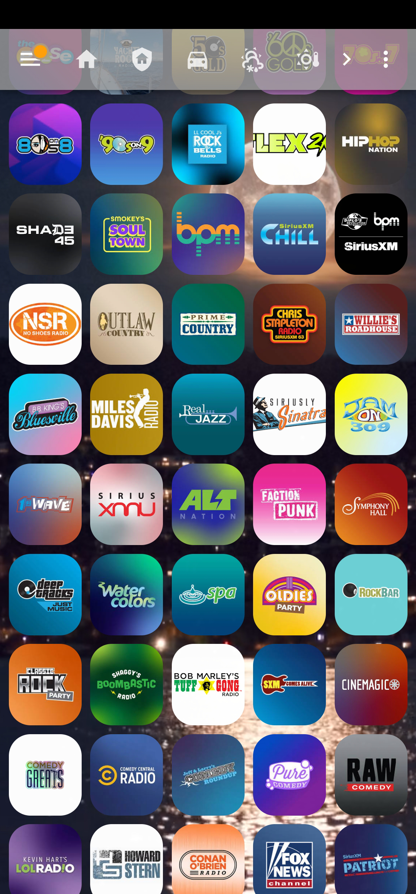

# SiriusXM Channels Grid for Home Assistant

This repository provides a Home Assistant Lovelace configuration for a 5-column grid of SiriusXM channel cards, featuring 10 main channels and a conditional dropdown with up to 60 additional channels. Each card toggles an `input_boolean` and shows a green border/glow when active. Example automations and scripts demonstrate playing stations via Amazon Alexa, native SiriusXM, Google Home, voice commands, and more.

## Screenshots


## Features
- **Channel Grid**: Displays 10 main channels (Classic Rewind, Classic Vinyl, etc.) in a 5x2 grid, with a conditional dropdown for up to 60 additional channels (e.g., Hair Nation, Turbo) when "Show More Stations" is toggled.
- **Picture Entity Cards**: Built-in cards with custom images and styling (80x80px, green border/glow when `on`, dimmed when `off`).
- **Mutual Exclusivity**: Ensures only one station’s `input_boolean` is `on`.
- **Playback Examples**: Automations for Alexa, SiriusXM, Google Home, voice commands, and scripts.
- **No Custom Cards**: Uses only built-in components, with `card-mod` for styling.

## Repository Contents
- `siriusxm-channels.yaml`: Lovelace grid with `picture-entity` cards for 10 main and 10 dropdown channels.
- `siriusxm_station_toggle.yaml`: Ensures one `input_boolean` is active.
- `siriusxm_station_play_example.yaml`: Plays stations on Alexa.
- `siriusxm_native_example.yaml`: Uses native SiriusXM integration.
- `siriusxm_google_home_example.yaml`: Plays on Google Home.
- `siriusxm_alexa_voice_example.yaml`: Triggers via Alexa voice commands.
- `siriusxm_play_script.yaml`: Reusable script for playback.
- `siriusxm_script_example.yaml`: Uses the script to play a station.
- `siriusxm_button_grid_example.yaml`: Alternative Lovelace grid with `button` cards.

## Prerequisites
- **Home Assistant**: Version 2023.6 or later.
- **Image Files**: PNG/JPG images, hosted locally (`<config_dir>/www/pictures/`) or via Nabu Casa.
- **Card Mod**: Custom component for CSS styling (install via HACS).
- **Input Boolean Helpers**: One per channel (e.g., `input_boolean.classic_rewind`).
- **Optional for Playback**:
  - **Alexa**: Alexa Media Player integration.
  - **SiriusXM**: Native SiriusXM integration (e.g., via HACS).
  - **Google Home**: Google Assistant integration.
  - **Voice Commands**: Alexa skill with custom intents.

## Setup Instructions

### Step 1: Create Input Boolean Helpers
1. Go to **Settings > Devices & Services > Helpers**.
2. Create a **Toggle** helper for each channel:
   - `input_boolean.classic_rewind`
   - `input_boolean.classic_vinyl`
   - `input_boolean.grateful_dead`
   - `input_boolean.lithium`
   - `input_boolean.octane`
   - `input_boolean.liquid_metal`
   - `input_boolean.ozzy_s_boneyard`
   - `input_boolean.bb_kings`
   - `input_boolean.yacht_rock`
   - `input_boolean.show_more_stations`
   - `input_boolean.hair_nation`
   - `input_boolean.turbo`
   - `input_boolean.underground`
   - `input_boolean.jam_on_2`
   - `input_boolean.road_trip`
   - `input_boolean.pearl_jam_radio`
   - `input_boolean.red_hot_peppers`
   - `input_boolean.dave_matthews`
   - `input_boolean.beatles`
   - `input_boolean.tom_petty`
3. Verify entity IDs in **Entities**.

### Step 2: Add Image Files
1. The YAML uses Nabu Casa URLs (e.g., `https://your-instance.ui.nabu.casa/local/pictures/ClassicRewind.png`).
2. Replace `your-instance` with your Nabu Casa instance ID (e.g., `a1b2c3d4`).
3. Host images:
   - **Local**: Place in `<config_dir>/www/pictures/` (e.g., `/config/www/pictures/ClassicRewind.png`) and access via `/local/pictures/ClassicRewind.png`.
   - **Nabu Casa**: Ensure images are in the `www/pictures/` directory of your Home Assistant instance.
4. Ensure filenames match (e.g., `ClassicRewind.png`) and images are PNG/JPG.

### Step 3: Add the Grid to Your Dashboard
1. Download `siriusxm-channels.yaml`.
2. Update image URLs with your Nabu Casa instance ID.
3. Add to Lovelace:
   - **Visual Editor**: **Edit Dashboard > Add Card > Manual**, paste YAML, save.
   - **YAML Mode**: Append to `cards` in **Raw Configuration Editor**:
     ```yaml
     views:
       - title: Music
         cards:
           # Paste siriusxm-channels.yaml
     ```
   - **File-Based**: Add to `ui-lovelace.yaml`.
4. Alternatively, use `siriusxm_button_grid_example.yaml` for direct playback (no `input_boolean`).

### Step 4: Add the Mutual Exclusivity Automation
1. Download `siriusxm_station_toggle.yaml`.
2. Add to Home Assistant:
   - **UI**: **Settings > Automations & Scenes > Create Automation > Edit in YAML**, paste, save.
   - **File-Based**: Append to `automations.yaml`, reload.
3. Test by toggling cards; only one should be active.

### Step 5: Add Playback Automations (Optional)
1. Choose a playback method:
   - **Alexa**: Use `siriusxm_station_play_example.yaml` as a template.
   - **Native SiriusXM**: Use `siriusxm_native_example.yaml`.
   - **Google Home**: Use `siriusxm_google_home_example.yaml`.
   - **Alexa Voice**: Use `siriusxm_alexa_voice_example.yaml`.
   - **Script**: Add `siriusxm_play_script.yaml` and use `siriusxm_script_example.yaml`.
2. Customize entity IDs, station names, and media players.
3. Add to Home Assistant:
   - **UI**: Paste into new automations.
   - **File-Based**: Append to `automations.yaml` or `scripts.yaml`, reload.
4. Test playback.

### Step 6: Test
1. Check dashboard:
   - Cards display images and toggle `input_boolean` (or play directly with button cards).
   - All cards show consistent styling (80x80px, green border/glow when `on`, dimmed when `off`).
2. Toggle cards to confirm one `input_boolean` is `on`.
3. Verify playback for your chosen method.

## Playing SiriusXM Stations with Amazon Alexa
This setup uses the **Alexa Media Player** integration to play SiriusXM stations. Tapping a card toggles its `input_boolean` to `on`, triggering an automation (e.g., `siriusxm_station_play_example.yaml`) that sends a `media_player.play_media` command to an Alexa device. The command specifies the station (e.g., `"classic rewind"`) and `media_content_type: SIRIUSXM`. The `siriusxm_station_toggle.yaml` ensures one station is active in the UI.

To set this up:
1. Install **Alexa Media Player** via **Settings > Devices & Services > Add Integration**.
2. Link your Alexa account and discover devices (e.g., `media_player.your_alexa`).
3. Create an automation per station, using `siriusxm_station_play_example.yaml`.
4. Link your SiriusXM account to Alexa.

## Alternative Playback Methods
The repository includes examples for triggering SiriusXM stations:

1. **Native SiriusXM Integration** (`siriusxm_native_example.yaml`):
   - Uses `media_player.select_source` for a SiriusXM media player.
   - Requires a SiriusXM integration.
2. **Google Home** (`siriusxm_google_home_example.yaml`):
   - Plays stations on Google Home via `media_player.play_media`.
   - Requires Google Assistant and SiriusXM linkage.
3. **Alexa Voice Commands** (`siriusxm_alexa_voice_example.yaml`):
   - Triggers `input_boolean` via Alexa intents (e.g., “Alexa, play Classic Rewind”).
   - Requires an Alexa skill and routine.
4. **Reusable Script** (`siriusxm_play_script.yaml`, `siriusxm_script_example.yaml`):
   - Script to play any station, called by automations or buttons.
5. **Button Cards** (`siriusxm_button_grid_example.yaml`):
   - Lovelace grid with `button` cards for direct playback, bypassing `input_boolean`.

## Troubleshooting
- **Cards Not Displaying**:
  - Ensure `input_boolean` entities exist (for `picture-entity`).
  - Check logs (**Settings > System > Logs**).
- **Inconsistent Card Styling**:
  - Verify `style` blocks in `siriusxm-channels.yaml` are identical for all cards.
  - Clear Lovelace cache: **Settings > Dashboards > More > Clear Cache**, or restart Home Assistant.
  - Test in a different browser or incognito mode to rule out browser caching.
- **Images Not Loading**:
  - Verify Nabu Casa URLs and files in `<config_dir>/www/pictures/`.
  - Check permissions and instance ID.
- **Screenshots Not Displaying**:
  - Confirm `screenshots/siriusxm_grid.png` exists.
  - Use raw URLs if needed (e.g., `https://raw.githubusercontent.com/afcragg78/siriusxm-channels-grid/main/screenshots/siriusxm_grid.png`).
- **Automation Not Working**:
  - Confirm entity IDs.
  - Test in **Developer Tools > States**.
- **Playback Issues**:
  - Verify integration and account linkage.
  - Ensure `media_content_id` matches expected format.
- **YAML Errors**:
  - Validate at [yaml-online-parser](https://yaml-online-parser.appspot.com/).
  - Use 2-space indentation.
- **Issues?**: Open a GitHub issue with Home Assistant version, logs, setup details.

## Customization
- **Add Channels**: Copy a card, update `entity` and `image`. Add to `siriusxm_station_toggle.yaml` and create a playback automation.
- **Styling**: Modify `style` in `siriusxm-channels.yaml`.
- **Playback**: Combine methods (e.g., Alexa and voice commands).

## Contributing
Fork, create a branch, make changes, submit a pull request.

## License
MIT License. See [LICENSE](LICENSE).

## Acknowledgments
- [Home Assistant](https://www.home-assistant.io/).
- [Alexa Media Player](https://github.com/custom-components/alexa_media_player).
